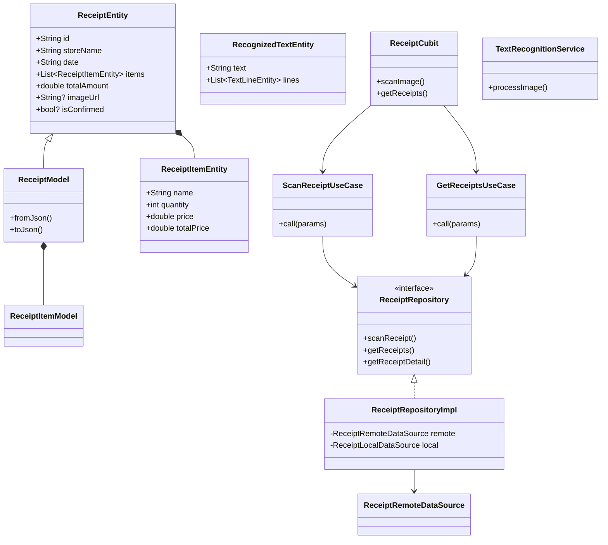
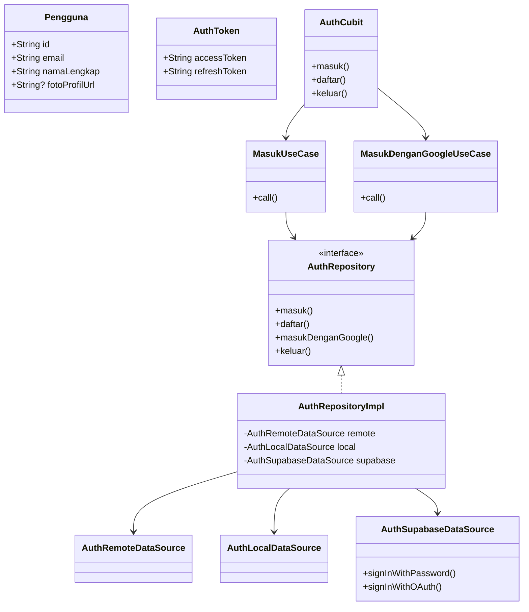

# Rancangan Class Diagram Aplikasi Client Snap Notes

## 1. Gambaran Umum Arsitektur

Aplikasi client Snap Notes dibangun menggunakan **Clean Architecture** dengan pemisahan menjadi tiga lapisan utama:
- **Presentation Layer**: UI, Cubit (State Management), Pages, Widgets
- **Domain Layer**: Entities, Repositories (abstract), UseCases
- **Data Layer**: Models, Repositories (implementation), DataSources

---

## 2. Class Diagram Lengkap (Mermaid Notation)

### 2.1. Diagram Kelas Keseluruhan Sistem

```mermaid
classDiagram
    direction TB
    
    %% ==================== CORE LAYER ====================
    class UseCase~Type, Params~ {
        <<abstract>>
        +call(Params params) Future~Either~Failure, Type~~
    }
    
    class NoParams {
        +props List~Object~
    }
    
    class Failure {
        <<abstract>>
        +message String
    }
    
    class ServerFailure {
        +message String
    }
    
    class CacheFailure {
        +message String
    }
    
    class Equatable {
        <<abstract>>
        +props List~Object?~
        +== bool
    }
    
    %% ==================== ENTITIES ====================
    class Pengguna {
        +id String
        +email String
        +namaLengkap String
        +fotoProfilUrl String?
        +createdAt DateTime
        +updatedAt DateTime
        +copyWith() Pengguna
    }
    
    class ReceiptEntity {
        +id String?
        +storeName String
        +date String
        +items List~ReceiptItemEntity~
        +totalAmount double
        +categoryId String?
        +categoryName String?
        +imageUrl String?
        +isConfirmed bool?
        +createdAt DateTime?
        +updatedAt DateTime?
    }
    
    class ReceiptItemEntity {
        +id String?
        +name String
        +quantity int
        +price double
        +totalPrice double
        +categoryId String?
        +categoryName String?
    }
    
    class RecognizedTextEntity {
        +text String
        +lines List~TextLineEntity~
        +imageWidth double
        +imageHeight double
    }
    
    class TextLineEntity {
        +lineIndex int
        +text String
        +boundingBox Rect
    }
    
    class Pemasukan {
        +id String
        +penggunaId String
        +kategoriId String?
        +kategoriNama String?
        +deskripsi String
        +jumlah double
        +tanggal DateTime
        +catatan String?
        +createdAt DateTime
        +updatedAt DateTime
    }
    
    class Pengeluaran {
        +id String
        +penggunaId String
        +strukId String?
        +kategoriId String?
        +kategoriNama String?
        +deskripsi String
        +jumlah double
        +tanggal DateTime
        +catatan String?
        +struk ReceiptEntity?
        +createdAt DateTime
        +updatedAt DateTime
    }
    
    class PreferensiNotifikasi {
        +id String?
        +hariAktif List~String~
        +jamNotifikasi String
        +aktif bool
    }
    
    class RingkasanDashboard {
        +totalPemasukan double
        +totalPengeluaran double
        +saldo double
    }
    
    class AuthToken {
        +accessToken String
        +refreshToken String
    }
    
    %% ==================== MODELS (Data Layer) ====================
    class ReceiptModel {
        +modelStoreName String
        +modelDate String
        +modelTotalAmount double
        +modelItems List~ReceiptItemModel~
        +id String?
        +imageUrl String?
        +isConfirmed bool?
        +modelCategoryId String?
        +modelCategoryName String?
        +modelCreatedAt DateTime?
        +modelUpdatedAt DateTime?
        +fromJson() ReceiptModel
        +toJson() Map~String, dynamic~
    }
    
    class ReceiptItemModel {
        +modelName String
        +modelQuantity int
        +modelPrice double
        +modelTotalPrice double
        +itemId String?
        +categoryId String?
        +categoryName String?
        +fromJson() ReceiptItemModel
        +toJson() Map~String, dynamic~
    }
    
    %% ==================== REPOSITORY INTERFACES ====================
    class AuthRepository {
        <<interface>>
        +masuk(email, password) Future~Either~Failure, Pengguna~~
        +daftar(email, password, namaLengkap) Future~Either~Failure, Pengguna~~
        +masukDenganGoogle() Future~Either~Failure, Pengguna~~
        +keluar() Future~Either~Failure, void~
        +getProfil() Future~Either~Failure, Pengguna~~
        +getToken() Future~Either~Failure, AuthToken~
    }
    
    class ReceiptRepository {
        <<interface>>
        +scanReceipt(imageFile, rawText) Future~Either~Failure, ReceiptEntity~~
        +getReceipts() Future~Either~Failure, List~ReceiptEntity~~
        +getReceiptDetail(id) Future~Either~Failure, ReceiptEntity~~
        +confirmReceipt(id) Future~Either~Failure, void~
        +deleteReceipt(id) Future~Either~Failure, void~
    }
    
    class PemasukanRepository {
        <<interface>>
        +getDaftarPemasukan() Future~Either~Failure, List~Pemasukan~~
        +getPemasukanDetail(id) Future~Either~Failure, Pemasukan~~
        +tambahPemasukan(data) Future~Either~Failure, Pemasukan~~
        +updatePemasukan(id, data) Future~Either~Failure, Pemasukan~~
        +hapusPemasukan(id) Future~Either~Failure, void~
    }
    
    class PengeluaranRepository {
        <<interface>>
        +getDaftarPengeluaran() Future~Either~Failure, List~Pengeluaran~~
        +getPengeluaranDetail(id) Future~Either~Failure, Pengeluaran~~
        +tambahPengeluaran(data) Future~Either~Failure, Pengeluaran~~
        +updatePengeluaran(id, data) Future~Either~Failure, Pengeluaran~~
        +hapusPengeluaran(id) Future~Either~Failure, void~
    }
    
    class NotifikasiRepository {
        <<interface>>
        +getPreferensi() Future~Either~Failure, PreferensiNotifikasi~~
        +simpanPreferensi(data) Future~Either~Failure, void~
        +toggleNotifikasi(aktif) Future~Either~Failure, void~
    }
    
    class DashboardRepository {
        <<interface>>
        +getRingkasanDashboard() Future~Either~Failure, RingkasanDashboard~~
        +getStatistikPengeluaran(period) Future~Either~Failure, Map~String, double~~
        +getHeatmapData() Future~Either~Failure, List~Map~String, dynamic~~
    }
    
    %% ==================== REPOSITORY IMPLEMENTATIONS ====================
    class AuthRepositoryImpl {
        -remoteDataSource AuthRemoteDataSource
        -localDataSource AuthLocalDataSource
        -supabaseDataSource AuthSupabaseDataSource
        +masuk() Future~Either~Failure, Pengguna~~
        +daftar() Future~Either~Failure, Pengguna~~
    }
    
    class ReceiptRepositoryImpl {
        -remoteDataSource ReceiptRemoteDataSource
        -localDataSource ReceiptLocalDataSource
        +scanReceipt() Future~Either~Failure, ReceiptEntity~~
        +getReceipts() Future~Either~Failure, List~ReceiptEntity~~
    }
    
    %% ==================== DATA SOURCES ====================
    class AuthRemoteDataSource {
        <<interface>>
        +masuk(credentials) Future~Pengguna~
        +daftar(data) Future~Pengguna~
        +refreshToken(token) Future~AuthToken~
    }
    
    class AuthLocalDataSource {
        <<interface>>
        +cacheToken(token) Future~void~
        +getCachedToken() Future~AuthToken~
        +clearCache() Future~void~
    }
    
    class AuthSupabaseDataSource {
        +signInWithPassword() Future~AuthResponse~
        +signUp() Future~AuthResponse~
        +signInWithOAuth() Future~bool~
        +signOut() Future~void~
    }
    
    class ReceiptRemoteDataSource {
        <<interface>>
        +uploadImage(file) Future~String~
        +scanReceipt(payload) Future~ReceiptModel~
        +getReceipts() Future~List~ReceiptModel~
    }
    
    class ReceiptLocalDataSource {
        <<interface>>
        +cacheReceipt(data) Future~void~
        +getCachedReceipts() Future~List~ReceiptModel~
        +clearCache() Future~void~
    }
    
    %% ==================== USE CASES ====================
    class MasukUseCase {
        -repository AuthRepository
        +call(params) Future~Either~Failure, Pengguna~~
    }
    
    class DaftarUseCase {
        -repository AuthRepository
        +call(params) Future~Either~Failure, Pengguna~~
    }
    
    class MasukDenganGoogleUseCase {
        -repository AuthRepository
        +call(params) Future~Either~Failure, Pengguna~~
    }
    
    class KeluarUseCase {
        -repository AuthRepository
        +call(params) Future~Either~Failure, void~
    }
    
    class GetProfilUseCase {
        -repository AuthRepository
        +call(params) Future~Either~Failure, Pengguna~~
    }
    
    class ScanReceiptUseCase {
        -repository ReceiptRepository
        +call(params) Future~Either~Failure, ReceiptEntity~~
    }
    
    class GetReceiptsUseCase {
        -repository ReceiptRepository
        +call(params) Future~Either~Failure, List~ReceiptEntity~~
    }
    
    class GetReceiptDetailUseCase {
        -repository ReceiptRepository
        +call(params) Future~Either~Failure, ReceiptEntity~~
    }
    
    class GetDaftarPemasukanUseCase {
        -repository PemasukanRepository
        +call(params) Future~Either~Failure, List~Pemasukan~~
    }
    
    class TambahPemasukanUseCase {
        -repository PemasukanRepository
        +call(params) Future~Either~Failure, Pemasukan~~
    }
    
    class GetDaftarPengeluaranUseCase {
        -repository PengeluaranRepository
        +call(params) Future~Either~Failure, List~Pengeluaran~~
    }
    
    class TambahPengeluaranUseCase {
        -repository PengeluaranRepository
        +call(params) Future~Either~Failure, Pengeluaran~~
    }
    
    class GetRingkasanDashboardUseCase {
        -repository DashboardRepository
        +call(params) Future~Either~Failure, RingkasanDashboard~~
    }
    
    %% ==================== CUBITS (Presentation Layer) ====================
    class AuthCubit {
        -masukUseCase MasukUseCase
        -daftarUseCase DaftarUseCase
        -keluarUseCase KeluarUseCase
        +state AuthState
        +masuk(email, password) void
        +daftar(data) void
        +keluar() void
    }
    
    class AuthState {
        <<abstract>>
    }
    
    class AuthInitial {
    }
    
    class AuthLoading {
    }
    
    class AuthAuthenticated {
        +pengguna Pengguna
    }
    
    class AuthUnauthenticated {
    }
    
    class AuthError {
        +message String
    }
    
    class ReceiptCubit {
        -scanReceiptUseCase ScanReceiptUseCase
        -getReceiptsUseCase GetReceiptsUseCase
        +state ReceiptState
        +scanImage(file) void
        +getReceipts() void
        +confirmReceipt(id) void
    }
    
    class ReceiptState {
        <<abstract>>
    }
    
    class ReceiptInitial {
    }
    
    class ReceiptScanning {
    }
    
    class ReceiptScanned {
        +receipt ReceiptEntity
        +rawText String
    }
    
    class ReceiptsLoaded {
        +receipts List~ReceiptEntity~
    }
    
    class ReceiptError {
        +message String
    }
    
    class PemasukanCubit {
        -getDaftarUseCase GetDaftarPemasukanUseCase
        -tambahUseCase TambahPemasukanUseCase
        +state PemasukanState
        +getDaftar() void
        +tambahPemasukan(data) void
    }
    
    class PemasukanState {
        <<abstract>>
    }
    
    class PengeluaranCubit {
        -getDaftarUseCase GetDaftarPengeluaranUseCase
        -tambahUseCase TambahPengeluaranUseCase
        +state PengeluaranState
        +getDaftar() void
        +tambahPengeluaran(data) void
    }
    
    class PengeluaranState {
        <<abstract>>
    }
    
    class DashboardCubit {
        -getRingkasanUseCase GetRingkasanDashboardUseCase
        +state DashboardState
        +loadDashboard() void
    }
    
    class DashboardState {
        <<abstract>>
    }
    
    %% ==================== SERVICES / UTILS ====================
    class TextRecognitionService {
        -_textRecognizer TextRecognizer
        +processImage(imageFile) Future~RecognizedTextEntity~
        +close() void
    }
    
    class ApiClient {
        -_dio Dio
        -_baseUrl String
        +get(path, headers) Future~Response~
        +post(path, data, headers) Future~Response~
        +put(path, data, headers) Future~Response~
        +delete(path, headers) Future~Response~
    }
    
    %% ==================== INHERITANCE RELATIONSHIPS ====================
    Equatable <|-- Pengguna
    Equatable <|-- ReceiptEntity
    Equatable <|-- ReceiptItemEntity
    Equatable <|-- RecognizedTextEntity
    Equatable <|-- TextLineEntity
    Equatable <|-- Pemasukan
    Equatable <|-- Pengeluaran
    Equatable <|-- PreferensiNotifikasi
    Equatable <|-- RingkasanDashboard
    Equatable <|-- AuthToken
    
    ReceiptEntity <|-- ReceiptModel
    ReceiptItemEntity <|-- ReceiptItemModel
    
    Failure <|-- ServerFailure
    Failure <|-- CacheFailure
    
    AuthRepository <|.. AuthRepositoryImpl
    ReceiptRepository <|.. ReceiptRepositoryImpl
    
    UseCase <|-- MasukUseCase
    UseCase <|-- DaftarUseCase
    UseCase <|-- ScanReceiptUseCase
    UseCase <|-- GetReceiptsUseCase
    UseCase <|-- GetDaftarPemasukanUseCase
    UseCase <|-- TambahPemasukanUseCase
    UseCase <|-- GetDaftarPengeluaranUseCase
    UseCase <|-- TambahPengeluaranUseCase
    UseCase <|-- GetRingkasanDashboardUseCase
    
    AuthState <|-- AuthInitial
    AuthState <|-- AuthLoading
    AuthState <|-- AuthAuthenticated
    AuthState <|-- AuthUnauthenticated
    AuthState <|-- AuthError
    
    ReceiptState <|-- ReceiptInitial
    ReceiptState <|-- ReceiptScanning
    ReceiptState <|-- ReceiptScanned
    ReceiptState <|-- ReceiptsLoaded
    ReceiptState <|-- ReceiptError
    
    Equatable <|-- AuthState
    Equatable <|-- ReceiptState
    Equatable <|-- PemasukanState
    Equatable <|-- PengeluaranState
    Equatable <|-- DashboardState
    
    %% ==================== COMPOSITION RELATIONSHIPS ====================
    AuthRepositoryImpl --> AuthRemoteDataSource
    AuthRepositoryImpl --> AuthLocalDataSource
    AuthRepositoryImpl --> AuthSupabaseDataSource
    
    ReceiptRepositoryImpl --> ReceiptRemoteDataSource
    ReceiptRepositoryImpl --> ReceiptLocalDataSource
    
    MasukUseCase --> AuthRepository
    DaftarUseCase --> AuthRepository
    ScanReceiptUseCase --> ReceiptRepository
    GetReceiptsUseCase --> ReceiptRepository
    
    AuthCubit --> MasukUseCase
    AuthCubit --> DaftarUseCase
    AuthCubit --> KeluarUseCase
    
    ReceiptCubit --> ScanReceiptUseCase
    ReceiptCubit --> GetReceiptsUseCase
    
    PemasukanCubit --> GetDaftarPemasukanUseCase
    PemasukanCubit --> TambahPemasukanUseCase
    
    PengeluaranCubit --> GetDaftarPengeluaranUseCase
    PengeluaranCubit --> TambahPengeluaranUseCase
    
    DashboardCubit --> GetRingkasanDashboardUseCase
    
    ReceiptEntity o-- ReceiptItemEntity
    ReceiptModel o-- ReceiptItemModel
    RecognizedTextEntity o-- TextLineEntity
```



---

## 3. Deskripsi Kelas-kelas Utama

### 3.1. Layer Domain (Business Logic)

#### **Entity Classes**

| Kelas | Deskripsi | Atribut Utama |
|-------|-----------|---------------|
| `Pengguna` | Representasi data pengguna aplikasi | id, email, namaLengkap, fotoProfilUrl |
| `ReceiptEntity` | Entity struk belanja hasil OCR | storeName, date, items, totalAmount, imageUrl |
| `ReceiptItemEntity` | Item barang dalam struk | name, quantity, price, totalPrice |
| `RecognizedTextEntity` | Hasil teks mentah dari OCR ML Kit | text, lines, imageWidth, imageHeight |
| `Pemasukan` | Data pemasukan pengguna | penggunaId, deskripsi, jumlah, tanggal |
| `Pengeluaran` | Data pengeluaran pengguna | penggunaId, strukId, deskripsi, jumlah, tanggal, struk |
| `PreferensiNotifikasi` | Pengaturan notifikasi pengguna | hariAktif, jamNotifikasi, aktif |
| `RingkasanDashboard` | Ringkasan keuangan untuk dashboard | totalPemasukan, totalPengeluaran, saldo |

#### **Repository Interfaces**

| Interface | Fungsi |
|-----------|--------|
| `AuthRepository` | Abstraksi operasi autentikasi (masuk, daftar, Google OAuth) |
| `ReceiptRepository` | Abstraksi operasi struk (scan, simpan, hapus) |
| `PemasukanRepository` | Abstraksi CRUD pemasukan |
| `PengeluaranRepository` | Abstraksi CRUD pengeluaran |
| `NotifikasiRepository` | Abstraksi pengaturan notifikasi lokal |
| `DashboardRepository` | Abstraksi pengambilan data statistik dashboard |

### 3.2. Layer Data (Data Access)

#### **Model Classes**
Model merupakan turunan dari Entity yang menambahkan:
- Anotasi JSON serialization (`@JsonSerializable`)
- Mapping field backend (bahasa Indonesia) ke field aplikasi
- Factory method `fromJson()` dan `toJson()`

| Kelas | Mapping Field |
|-------|---------------|
| `ReceiptModel` | namaToko→storeName, tanggalBelanja→date, total→totalAmount |
| `ReceiptItemModel` | namaItem→name, jumlah→quantity, hargaSatuan→price |

#### **DataSource Classes**

| Kelas | Tipe | Fungsi |
|-------|------|--------|
| `AuthRemoteDataSource` | Remote | Komunikasi HTTP dengan backend NestJS |
| `AuthLocalDataSource` | Local | Penyimpanan token di SharedPreferences |
| `AuthSupabaseDataSource` | Remote | Integrasi autentikasi Supabase Auth |
| `ReceiptRemoteDataSource` | Remote | Upload gambar dan scan receipt via API |
| `ReceiptLocalDataSource` | Local | Cache receipt sementara |

### 3.3. Layer Presentation (UI)

#### **Cubit Classes (State Management)**

| Cubit | State yang Dikelola | UseCase yang Digunakan |
|-------|---------------------|------------------------|
| `AuthCubit` | AuthInitial, AuthLoading, AuthAuthenticated, AuthError | MasukUseCase, DaftarUseCase, KeluarUseCase |
| `ReceiptCubit` | ReceiptInitial, ReceiptScanning, ReceiptScanned, ReceiptsLoaded, ReceiptError | ScanReceiptUseCase, GetReceiptsUseCase |
| `PemasukanCubit` | PemasukanListState, PemasukanFormState | GetDaftarPemasukanUseCase, TambahPemasukanUseCase |
| `PengeluaranCubit` | PengeluaranListState, PengeluaranFormState | GetDaftarPengeluaranUseCase, TambahPengeluaranUseCase |
| `DashboardCubit` | DashboardInitial, DashboardLoading, DashboardLoaded | GetRingkasanDashboardUseCase |
| `NotifikasiCubit` | NotifikasiListState, NotifikasiFormState | GetPreferensiUseCase, SimpanPreferensiUseCase |

---

## 4. Diagram Class per Feature Module

### 4.1. Feature: Receipt (Scan Struk)



### 4.2. Feature: Authentication



---

## 5. Relasi Antar Kelas

### 5.1. Inheritance (Pewarisan)

```
Equatable
├── Pengguna
├── ReceiptEntity
│   └── ReceiptModel
├── ReceiptItemEntity
│   └── ReceiptItemModel
├── Pemasukan
├── Pengeluaran
├── RecognizedTextEntity
├── PreferensiNotifikasi
└── RingkasanDashboard

UseCase
├── MasukUseCase
├── DaftarUseCase
├── ScanReceiptUseCase
├── GetReceiptsUseCase
└── ... (20+ use cases)

Failure
├── ServerFailure
└── CacheFailure
```

### 5.2. Dependency (Ketergantungan)

**Arsitektur Clean Architecture mengikuti aturan dependency:**
- **Presentation Layer** → depends on → **Domain Layer**
- **Data Layer** → depends on → **Domain Layer**
- **Domain Layer** → no external dependencies (pure business logic)

```
Presentation (Cubit) → UseCase → Repository Interface → Entity
                                        ↑
Data (RepositoryImpl) → DataSource → Model (extends Entity)
```

### 5.3. Composition (Komposisi)

| Parent Class | Child Class | Relasi |
|--------------|-------------|--------|
| ReceiptEntity | ReceiptItemEntity | 1 to many |
| ReceiptModel | ReceiptItemModel | 1 to many |
| RecognizedTextEntity | TextLineEntity | 1 to many |
| Pengeluaran | ReceiptEntity | 1 to 1 (optional) |

---

## 6. Alur Data dalam Class Diagram

### 6.1. Alur Scan Struk (OCR + AI)

```
┌─────────────────┐     ┌─────────────────────┐     ┌──────────────────┐
│  ScannerPage    │────▶│  ReceiptCubit       │────▶│ TextRecognition │
│  (UI)           │     │  (State Management) │     │  Service (ML Kit) │
└─────────────────┘     └─────────────────────┘     └──────────────────┘
                               │
                               ▼
                        ┌─────────────────────┐
                        │ ScanReceiptUseCase  │
                        └─────────────────────┘
                               │
                               ▼
                        ┌─────────────────────┐
                        │ ReceiptRepository   │
                        │   (Interface)       │
                        └─────────────────────┘
                               │
                               ▼
                        ┌─────────────────────┐
                        │ ReceiptRepositoryImpl
                        └─────────────────────┘
                               │
               ┌───────────────┴───────────────┐
               ▼                               ▼
        ┌─────────────────┐            ┌─────────────────┐
        │ ReceiptRemote   │            │ ReceiptLocal    │
        │ DataSource      │            │ DataSource      │
        └─────────────────┘            └─────────────────┘
               │
               ▼
        ┌─────────────────┐
        │ Backend NestJS  │
        │ (Gemini AI OCR) │
        └─────────────────┘
```

---

## 7. Penjelasan Design Pattern yang Digunakan

### 7.1. Repository Pattern
- **Tujuan**: Abstraksi data source (remote vs local)
- **Implementasi**: Interface di Domain, Implementation di Data
- **Contoh**: `ReceiptRepository` (interface) → `ReceiptRepositoryImpl` (implementation)

### 7.2. Use Case Pattern (Command Pattern)
- **Tujuan**: Enkapsulasi business logic per fitur
- **Implementasi**: Setiap use case extends `UseCase<Type, Params>`
- **Contoh**: `ScanReceiptUseCase`, `TambahPemasukanUseCase`

### 7.3. Cubit Pattern (BLoC Simplified)
- **Tujuan**: State management yang reaktif
- **Implementasi**: Emit state berdasarkan event
- **Contoh**: `ReceiptCubit` mengelola `ReceiptState`

### 7.4. Dependency Injection
- **Tujuan**: Loose coupling antar komponen
- **Implementasi**: Menggunakan `get_it` service locator
- **File**: `injection_container.dart`

---

## 8. Struktur Folder Berdasarkan Class Diagram

```
lib/
├── core/
│   ├── error/
│   │   └── failures.dart           # Failure classes
│   ├── network/
│   │   └── api_client.dart         # ApiClient class
│   └── usecase/
│       └── usecase.dart            # UseCase abstract class
│
├── features/
│   ├── auth/
│   │   ├── data/
│   │   │   ├── datasources/
│   │   │   │   ├── auth_local_datasource.dart
│   │   │   │   ├── auth_remote_datasource.dart
│   │   │   │   └── auth_supabase_datasource.dart
│   │   │   ├── models/
│   │   │   │   └── ...
│   │   │   └── repositories/
│   │   │       └── auth_repository_impl.dart
│   │   ├── domain/
│   │   │   ├── entities/
│   │   │   │   ├── pengguna.dart
│   │   │   │   └── auth_token.dart
│   │   │   ├── repositories/
│   │   │   │   └── auth_repository.dart
│   │   │   └── usecases/
│   │   │       ├── masuk.dart
│   │   │       ├── daftar.dart
│   │   │       ├── masuk_dengan_google.dart
│   │   │       └── keluar.dart
│   │   └── presentation/
│   │       ├── cubit/
│   │       │   ├── auth_cubit.dart
│   │       │   └── auth_state.dart
│   │       └── pages/
│   │           ├── login_page.dart
│   │           └── register_page.dart
│   │
│   ├── receipt/
│   │   ├── data/
│   │   │   ├── datasources/
│   │   │   │   ├── receipt_local_datasource.dart
│   │   │   │   └── receipt_remote_datasource.dart
│   │   │   ├── models/
│   │   │   │   ├── receipt_model.dart
│   │   │   │   └── receipt_item_model.dart
│   │   │   └── repositories/
│   │   │       └── receipt_repository_impl.dart
│   │   ├── domain/
│   │   │   ├── entities/
│   │   │   │   ├── receipt_entity.dart
│   │   │   │   └── recognized_text_entity.dart
│   │   │   ├── repositories/
│   │   │   │   └── receipt_repository.dart
│   │   │   └── usecases/
│   │   │       ├── scan_receipt.dart
│   │   │       ├── get_receipts.dart
│   │   │       └── get_receipt_detail.dart
│   │   └── presentation/
│   │       ├── bloc/
│   │       │   ├── receipt_bloc.dart
│   │       │   └── receipt_state.dart
│   │       ├── cubit/
│   │       │   ├── receipt_detail_cubit.dart
│   │       │   └── receipt_history_cubit.dart
│   │       └── pages/
│   │           ├── scanner_page.dart
│   │           └── receipt_detail_page.dart
│   │
│   ├── pemasukan/
│   │   ├── data/...
│   │   ├── domain/...
│   │   └── presentation/...
│   │
│   ├── pengeluaran/
│   │   ├── data/...
│   │   ├── domain/...
│   │   └── presentation/...
│   │
│   ├── notifikasi/
│   │   ├── data/...
│   │   ├── domain/...
│   │   └── presentation/...
│   │
│   └── dashboard/
│       ├── data/...
│       ├── domain/...
│       └── presentation/...
│
├── injection_container.dart    # Dependency Injection setup
└── main.dart
```

---

## 9. Catatan untuk Implementasi di Draw.io

Untuk membuat visualisasi fisik Class Diagram di **draw.io**, berikut panduan pembuatan:

### Warna dan Kategori Kelas:

| Layer | Warna Box | Warna Text | Contoh Kelas |
|-------|-----------|------------|--------------|
| **Presentation** | 🟦 Biru Muda | Hitam | AuthCubit, ReceiptCubit |
| **Domain - Entity** | 🟩 Hijau | Hitam | Pengguna, ReceiptEntity |
| **Domain - Repository Interface** | 🟩 Hijau Tua | Putih | AuthRepository, ReceiptRepository |
| **Domain - UseCase** | 🟨 Kuning | Hitam | MasukUseCase, ScanReceiptUseCase |
| **Data - Model** | 🟧 Oranye | Hitam | ReceiptModel, ReceiptItemModel |
| **Data - Repository Impl** | 🟧 Oranye Tua | Putih | AuthRepositoryImpl |
| **Data - DataSource** | 🟥 Merah Muda | Hitam | AuthRemoteDataSource |
| **Core/Utils** | ⬅️ Abu-abu | Hitam | UseCase, Failure, ApiClient |

### Simbol Relasi:
- **Inheritance (extends)**: △ Panah kosong ke atas (putih)
- **Implementation (implements)**: △ Panah kosong + garis putus-putus
- **Dependency (uses)**: → Panah terbuka dengan garis putus-putus
- **Association (has-a)**: ─ Garis solid dengan panah terbuka
- **Composition (owns)**: ◆ Diamond hitam di parent
- **Aggregation (has reference)**: ◇ Diamond kosong di parent

### Layout yang Direkomendasikan:
1. **Kelompokkan per Layer**: Presentation (atas), Domain (tengah), Data (bawah)
2. **Feature Module**: Pisahkan dengan container/boundary
3. **Core Classes**: Letakkan di sisi kiri sebagai referensi

---

## 10. Referensi untuk BAB 3 Skripsi

### Kutipan untuk Bagian Perancangan Kelas:

> "Perancangan class diagram aplikasi client mengikuti prinsip **Clean Architecture** yang memisahkan tanggung jawab ke dalam tiga lapisan utama: *Presentation*, *Domain*, dan *Data Layer*. Setiap *feature module* (auth, receipt, pemasukan, pengeluaran, notifikasi, dashboard) memiliki struktur yang konsisten dengan entitas, repository interface, use case, dan state management menggunakan Cubit pattern."

### Tabel Ringkasan Jumlah Kelas:

| Layer | Jumlah Class | Kategori |
|-------|--------------|----------|
| Presentation | ~25 | Cubit, State, Page |
| Domain | ~30 | Entity, Repository Interface, UseCase |
| Data | ~35 | Model, Repository Impl, DataSource |
| Core | ~5 | Base classes, Error handling |
| **Total** | **~95** | - |

---

**Dokumen ini dapat langsung dijadikan referensi untuk:**
1. Pembuatan visual diagram di draw.io/Lucidchart
2. Penulisan subbab Perancangan Kelas di BAB 3
3. Dokumentasi arsitektur sistem untuk Lampiran

---
*Disusun sesuai standar penulisan skripsi Teknik Informatika UNIKOM*
