# Class Diagram — Snap Notes Flutter Client

Dokumen ini berisi rancangan class diagram untuk aplikasi Flutter client dengan Clean Architecture.

---

## 1. Overview Arsitektur

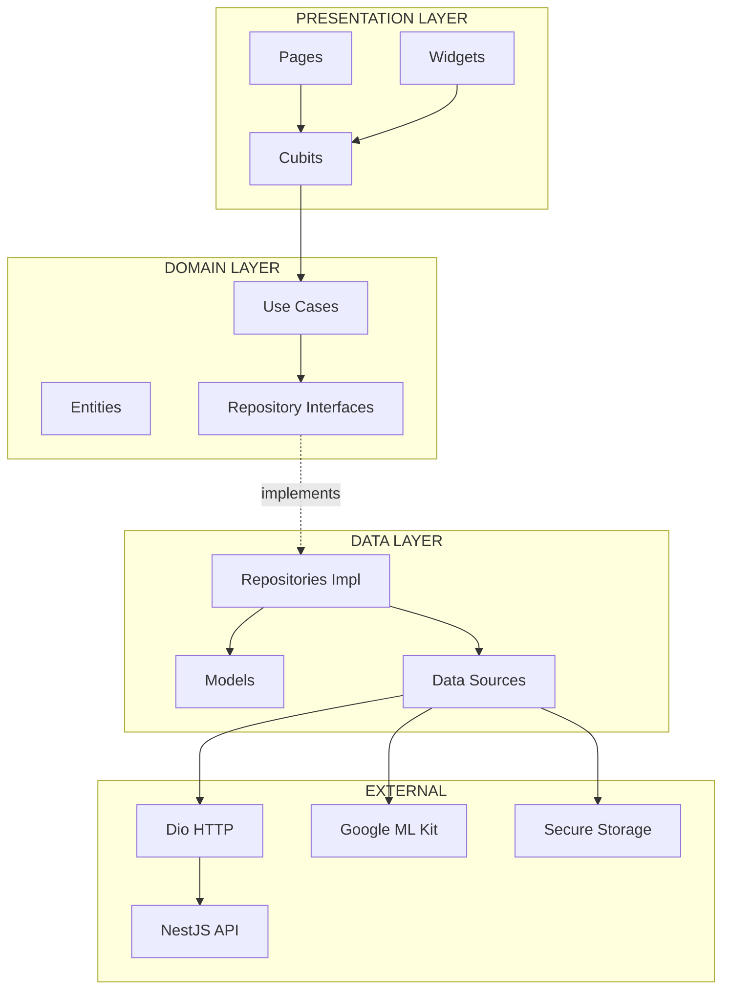

---

## 2. Core Layer — Error Handling & Utilities

### 2.1 Failure Classes (dartz)

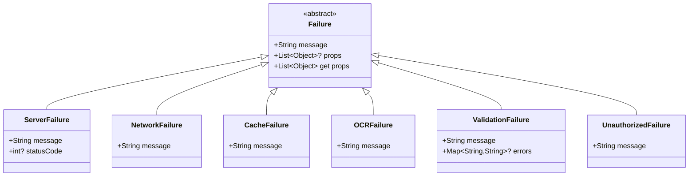

### 2.2 Exceptions

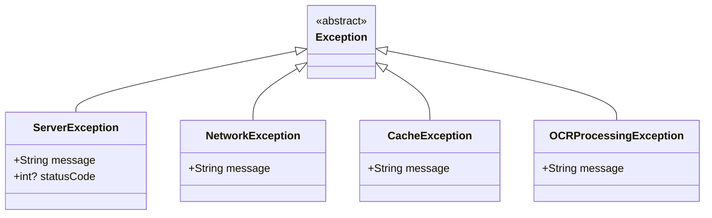

### 2.3 UseCase Base Class

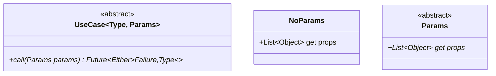

---

## 3. Domain Layer — Entities

### 3.1 Entity Class Diagram

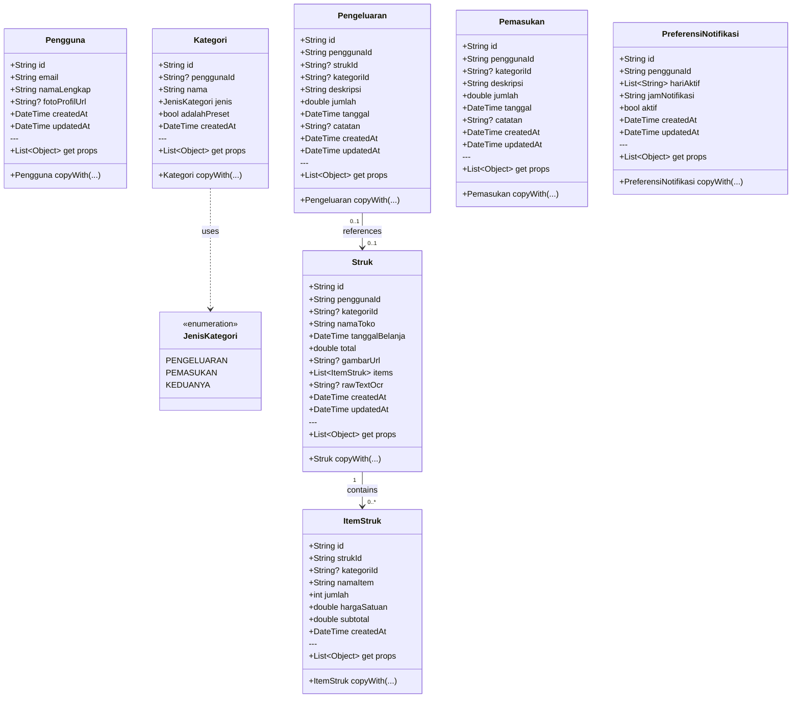

---

## 4. Domain Layer — Repository Interfaces

### 4.1 Repository Interfaces

```mermaid
classDiagram
    class AuthRepository {
        <<interface>>
        +daftar(DaftarParams params) Future~Either~Failure,Pengguna~~
        +masuk(MasukParams params) Future~Either~Failure,AuthToken~~
        +keluar() Future~Either~Failure,void~~
        +refreshToken(String refreshToken) Future~Either~Failure,AuthToken~~
        +getProfil() Future~Either~Failure,Pengguna~~
        +updateProfil(UpdateProfilParams params) Future~Either~Failure,Pengguna~~
    }
    
    class ScanStrukRepository {
        <<interface>>
        +scanStruk(ScanStrukParams params) Future~Either~Failure,Struk~~
        +getDaftarStruk(QueryStrukParams params) Future~Either~Failure,List~Struk~~
        +getDetailStruk(String id) Future~Either~Failure,Struk~~
        +updateStruk(UpdateStrukParams params) Future~Either~Failure,Struk~~
        +hapusStruk(String id) Future~Either~Failure,void~~
        +konfirmasiStruk(String id) Future~Either~Failure,Struk~~
    }
    
    class PengeluaranRepository {
        <<interface>>
        +getDaftarPengeluaran(QueryPengeluaranParams params) Future~Either~Failure,List~Pengeluaran~~
        +getDetailPengeluaran(String id) Future~Either~Failure,Pengeluaran~~
        +tambahPengeluaran(TambahPengeluaranParams params) Future~Either~Failure,Pengeluaran~~
        +updatePengeluaran(UpdatePengeluaranParams params) Future~Either~Failure,Pengeluaran~~
        +hapusPengeluaran(String id) Future~Either~Failure,void~~
    }
    
    class PemasukanRepository {
        <<interface>>
        +getDaftarPemasukan(QueryPemasukanParams params) Future~Either~Failure,List~Pemasukan~~
        +getDetailPemasukan(String id) Future~Either~Failure,Pemasukan~~
        +tambahPemasukan(TambahPemasukanParams params) Future~Either~Failure,Pemasukan~~
        +updatePemasukan(UpdatePemasukanParams params) Future~Either~Failure,Pemasukan~~
        +hapusPemasukan(String id) Future~Either~Failure,void~~
    }
    
    class KategoriRepository {
        <<interface>>
        +getDaftarKategori() Future~Either~Failure,List~Kategori~~
        +tambahKategori(TambahKategoriParams params) Future~Either~Failure,Kategori~~
        +updateKategori(UpdateKategoriParams params) Future~Either~Failure,Kategori~~
        +hapusKategori(String id) Future~Either~Failure,void~~
    }
    
    class DashboardRepository {
        <<interface>>
        +getRingkasan(int bulan, int tahun) Future~Either~Failure,Ringkasan~~
        +getKalender(int bulan, int tahun) Future~Either~Failure,Kalender~~
        +getTren(String bulanMulai, String bulanSelesai) Future~Either~Failure,Tren~~
        +getPerKategori(int bulan, int tahun) Future~Either~Failure,List~KategoriStat~~
    }
    
    class NotifikasiRepository {
        <<interface>>
        +getPreferensi() Future~Either~Failure,PreferensiNotifikasi~~
        +simpanPreferensi(SimpanPreferensiParams params) Future~Either~Failure,PreferensiNotifikasi~~
        +updatePreferensi(UpdatePreferensiParams params) Future~Either~Failure,PreferensiNotifikasi~~
    }
```

---

## 5. Domain Layer — Use Cases

### 5.1 Auth Use Cases

```mermaid
classDiagram
    class Masuk {
        -AuthRepository repository
        +call(MasukParams params) Future~Either~Failure,AuthToken~~
    }
    
    class MasukParams {
        +String email
        +String password
        +List~Object~ get props
    }
    
    class Daftar {
        -AuthRepository repository
        +call(DaftarParams params) Future~Either~Failure,Pengguna~~
    }
    
    class DaftarParams {
        +String email
        +String password
        +String namaLengkap
        +List~Object~ get props
    }
    
    class Keluar {
        -AuthRepository repository
        -AuthLocalDataSource localDataSource
        +call(NoParams params) Future~Either~Failure,void~~
    }
    
    class GetProfil {
        -AuthRepository repository
        +call(NoParams params) Future~Either~Failure,Pengguna~~
    }
    
    class UpdateProfil {
        -AuthRepository repository
        +call(UpdateProfilParams params) Future~Either~Failure,Pengguna~~
    }
    
    class UpdateProfilParams {
        +String? namaLengkap
        +File? fotoProfil
        +List~Object~ get props
    }
    
    UseCase <|-- Masuk
    UseCase <|-- Daftar
    UseCase <|-- Keluar
    UseCase <|-- GetProfil
    UseCase <|-- UpdateProfil
    
    Params <|-- MasukParams
    Params <|-- DaftarParams
    Params <|-- UpdateProfilParams
```

### 5.2 Scan Struk Use Cases

```mermaid
classDiagram
    class ScanStruk {
        -ScanStrukRepository repository
        +call(ScanStrukParams params) Future~Either~Failure,Struk~~
    }
    
    class ScanStrukParams {
        +File gambar
        +String rawText
        +List~Object~ get props
    }
    
    class GetDetailStruk {
        -ScanStrukRepository repository
        +call(String id) Future~Either~Failure,Struk~~
    }
    
    class UpdateStruk {
        -ScanStrukRepository repository
        +call(UpdateStrukParams params) Future~Either~Failure,Struk~~
    }
    
    class UpdateStrukParams {
        +String id
        +String? namaToko
        +DateTime? tanggalBelanja
        +List~ItemStruk~? items
        +List~Object~ get props
    }
    
    class HapusStruk {
        -ScanStrukRepository repository
        +call(String id) Future~Either~Failure,void~~
    }
    
    class KonfirmasiStruk {
        -ScanStrukRepository repository
        +call(String id) Future~Either~Failure,Struk~~
    }
    
    UseCase <|-- ScanStruk
    UseCase <|-- GetDetailStruk
    UseCase <|-- UpdateStruk
    UseCase <|-- HapusStruk
    UseCase <|-- KonfirmasiStruk
    
    Params <|-- ScanStrukParams
    Params <|-- UpdateStrukParams
```

### 5.3 Pengeluaran Use Cases

```mermaid
classDiagram
    class GetDaftarPengeluaran {
        -PengeluaranRepository repository
        +call(QueryPengeluaranParams params) Future~Either~Failure,List~Pengeluaran~~
    }
    
    class QueryPengeluaranParams {
        +int? bulan
        +int? tahun
        +String? kategoriId
        +int page
        +int limit
        +List~Object~ get props
    }
    
    class TambahPengeluaran {
        -PengeluaranRepository repository
        +call(TambahPengeluaranParams params) Future~Either~Failure,Pengeluaran~~
    }
    
    class TambahPengeluaranParams {
        +String deskripsi
        +double jumlah
        +DateTime tanggal
        +String? kategoriId
        +String? catatan
        +String? strukId
        +List~Object~ get props
    }
    
    class UpdatePengeluaran {
        -PengeluaranRepository repository
        +call(UpdatePengeluaranParams params) Future~Either~Failure,Pengeluaran~~
    }
    
    class HapusPengeluaran {
        -PengeluaranRepository repository
        +call(String id) Future~Either~Failure,void~~
    }
    
    UseCase <|-- GetDaftarPengeluaran
    UseCase <|-- TambahPengeluaran
    UseCase <|-- UpdatePengeluaran
    UseCase <|-- HapusPengeluaran
    
    Params <|-- QueryPengeluaranParams
    Params <|-- TambahPengeluaranParams
```

---

## 6. Data Layer — Models

### 6.1 Model Class Diagram

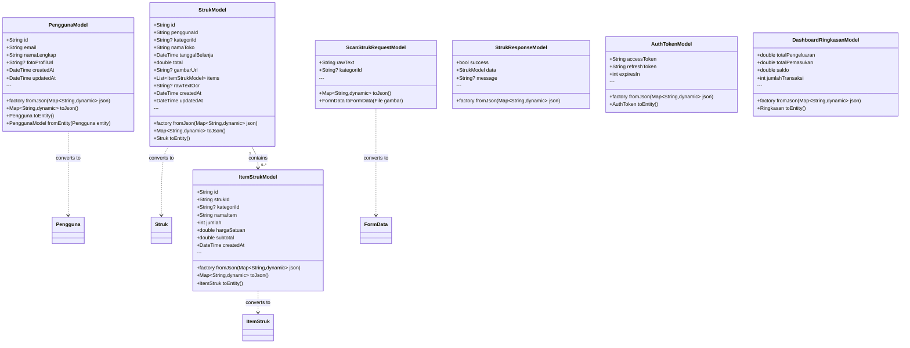

---

## 7. Data Layer — Data Sources

### 7.1 Remote Data Sources

```mermaid
classDiagram
    class AuthRemoteDataSource {
        -Dio dio
        ---
        +daftar(DaftarRequestModel request) Future~AuthResponseModel~
        +masuk(MasukRequestModel request) Future~AuthTokenModel~
        +keluar() Future~void~
        +refreshToken(String refreshToken) Future~AuthTokenModel~
        +getProfil() Future~PenggunaModel~
        +updateProfil(UpdateProfilRequestModel request) Future~PenggunaModel~
    }
    
    class ScanStrukRemoteDataSource {
        -Dio dio
        ---
        +scanStruk(ScanStrukRequestModel request, File gambar) Future~StrukResponseModel~
        +getDaftarStruk(QueryStrukParams params) Future~List~StrukModel~~
        +getDetailStruk(String id) Future~StrukModel~
        +updateStruk(String id, UpdateStrukRequestModel request) Future~StrukModel~
        +hapusStruk(String id) Future~void~
        +konfirmasiStruk(String id) Future~StrukModel~
    }
    
    class DashboardRemoteDataSource {
        -Dio dio
        ---
        +getRingkasan(int bulan, int tahun) Future~DashboardRingkasanModel~
        +getKalender(int bulan, int tahun) Future~KalenderResponseModel~
        +getTren(String bulanMulai, String bulanSelesai) Future~TrenResponseModel~
        +getPerKategori(int bulan, int tahun) Future~List~KategoriStatModel~~
    }
    
    class PengeluaranRemoteDataSource {
        -Dio dio
        ---
        +getDaftar(QueryPengeluaranParams params) Future~List~PengeluaranModel~~
        +getDetail(String id) Future~PengeluaranModel~
        +tambah(TambahPengeluaranRequestModel request) Future~PengeluaranModel~
        +update(String id, UpdatePengeluaranRequestModel request) Future~PengeluaranModel~
        +hapus(String id) Future~void~
    }
```

### 7.2 Local Data Sources

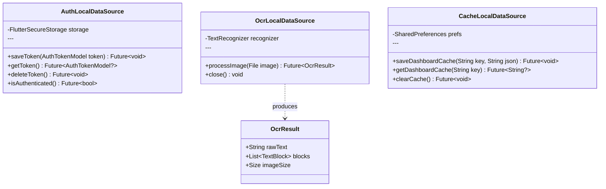

---

## 8. Data Layer — Repository Implementations

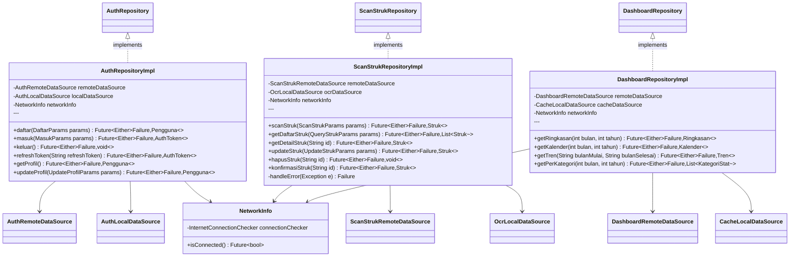

---

## 9. Presentation Layer — Hybrid State Management Strategy

### 9.0 Overview: Cubit vs Bloc Selection

Snap Notes menggunakan **pendekatan hybrid** untuk state management: **Cubit sebagai default (80%)** dan **Bloc untuk flow kompleks (20%)**.

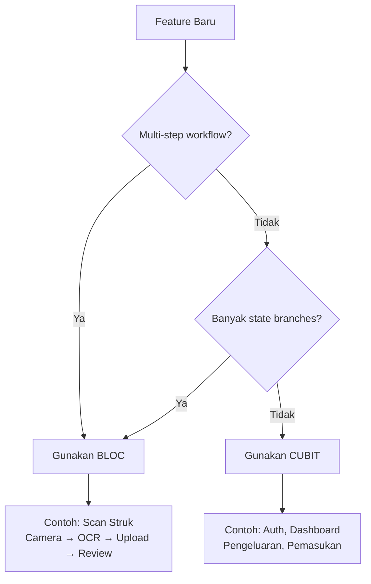

### Feature Mapping

| Feature | Type | Cubit/Bloc | Alasan |
|---------|------|------------|--------|
| **Auth** | Simple | **Cubit** | Login/logout/refresh |
| **Scan Struk** | Complex | **Bloc** | Multi-step workflow |
| **Dashboard** | Simple | **Cubit** | Fetch & display |
| **Pengeluaran** | Simple | **Cubit** | CRUD sederhana |
| **Pemasukan** | Simple | **Cubit** | CRUD sederhana |
| **Kategori** | Simple | **Cubit** | CRUD sederhana |
| **Notifikasi** | Simple | **Cubit** | Setting simpel |

---

## 9. Presentation Layer — Cubits (Simple Features)

### 9.1 Auth Cubits

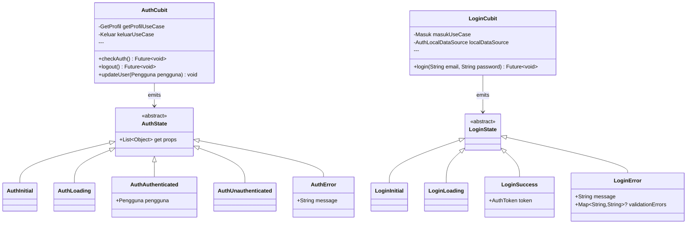

### 9.2 Scan Struk Cubits

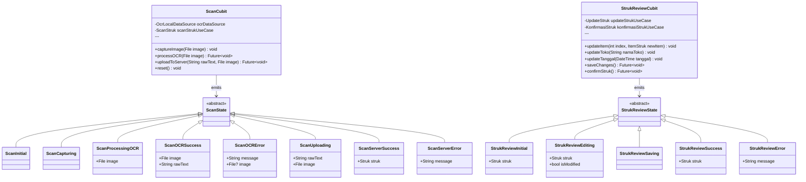

### 9.3 Dashboard Cubit

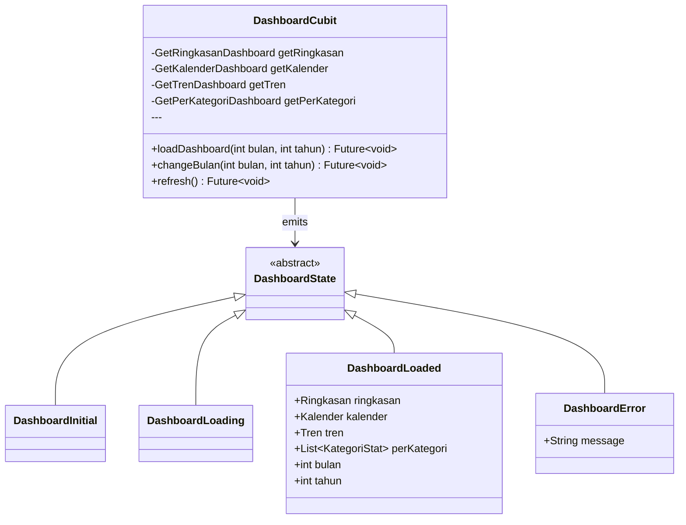

---

## 9.4 Blocs (Complex Features — Event-Based)

### 9.4.1 Scan Struk Bloc (ReceiptBloc)

**Tipe**: Bloc dengan Events (flow kompleks: Camera → OCR → Upload → Review)

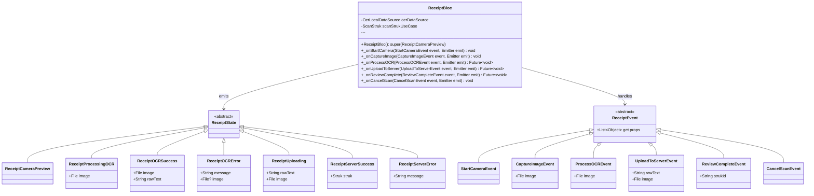

### Perbedaan Cubit vs Bloc di Snap Notes

| Aspek | Cubit (Simple) | Bloc (Complex) |
|-------|---------------|----------------|
| **Trigger** | Method call langsung | Event dispatch |
| **State Machine** | Linear | Complex branching |
| **Use Case** | 80% fitur (Auth, Dashboard, CRUD) | 20% fitur (Scan Struk) |
| **Boilerplate** | Minimal | Event classes tambahan |
| **Debugging** | Simple state trace | Event + state trace |

---

## 10. Presentation Layer — Pages & Widgets

### 10.1 Page Structure

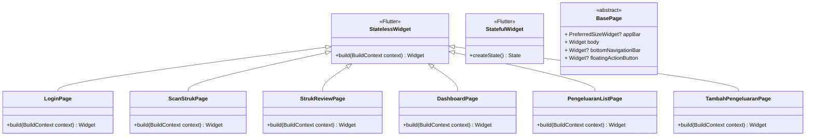

### 10.2 Reusable Widgets

```mermaid
classDiagram
    class AppButton {
        +String label
        +VoidCallback? onPressed
        +ButtonType type
        +bool isLoading
        +build(BuildContext context) Widget
    }
    
    class AppTextField {
        +String label
        +String? hint
        +TextEditingController controller
        +String? Function(String?)? validator
        +bool obscureText
        +Widget? suffixIcon
        +build(BuildContext context) Widget
    }
    
    class AppCard {
        +Widget child
        +EdgeInsets? padding
        +VoidCallback? onTap
        +build(BuildContext context) Widget
    }
    
    class LoadingIndicator {
        +String? message
        +build(BuildContext context) Widget
    }
    
    class ErrorWidget {
        +String message
        +VoidCallback? onRetry
        +build(BuildContext context) Widget
    }
    
    class StrukPreviewCard {
        +Struk struk
        +VoidCallback? onTap
        +VoidCallback? onDelete
        +build(BuildContext context) Widget
    }
    
    class ItemStrukListTile {
        +ItemStruk item
        +VoidCallback? onEdit
        +VoidCallback? onDelete
        +build(BuildContext context) Widget
    }
    
    class DashboardSummaryCard {
        +String title
        +double amount
        +IconData icon
        +Color color
        +build(BuildContext context) Widget
    }
    
    class CalendarView {
        +DateTime focusedMonth
        +Map~DateTime,List~dynamic~~ events
        +Function(DateTime)? onDaySelected
        +build(BuildContext context) Widget
    }
```

---

## 11. Dependency Injection (GetIt)

```mermaid
classDiagram
    class InjectionContainer {
        +GetIt sl
        ---
        +init() Future~void~
        -registerExternalDependencies() void
        -registerCoreDependencies() void
        -registerAuthDependencies() void
        -registerScanStrukDependencies() void
        -registerPengeluaranDependencies() void
        -registerDashboardDependencies() void
        -registerNotifikasiDependencies() void
    }
    
    class GetIt {
        <<singleton>>
        +registerFactory~T~(FactoryFunc~T~ factoryFunc)
        +registerLazySingleton~T~(FactoryFunc~T~ factoryFunc)
        +registerSingleton~T~(T instance)
        +T call~T~()
    }
    
    class ExternalDeps {
        +Dio dio
        +FlutterSecureStorage secureStorage
        +TextRecognizer textRecognizer
        +InternetConnectionChecker connectionChecker
    }
    
    InjectionContainer ..> GetIt : uses
    InjectionContainer ..> ExternalDeps : registers
```

### Registration Flow

```
sl.registerLazySingleton(() => Dio())
sl.registerLazySingleton(() => FlutterSecureStorage())
sl.registerLazySingleton(() => TextRecognizer())

// Data Sources
sl.registerLazySingleton<AuthRemoteDataSource>(() => AuthRemoteDataSourceImpl(sl()))
sl.registerLazySingleton<AuthLocalDataSource>(() => AuthLocalDataSourceImpl(sl()))
sl.registerLazySingleton<OcrLocalDataSource>(() => OcrLocalDataSourceImpl(sl()))

// Repositories
sl.registerLazySingleton<AuthRepository>(() => AuthRepositoryImpl(sl(), sl(), sl()))
sl.registerLazySingleton<ScanStrukRepository>(() => ScanStrukRepositoryImpl(sl(), sl(), sl()))

// Use Cases
sl.registerLazySingleton(() => Masuk(sl()))
sl.registerLazySingleton(() => ScanStruk(sl()))

// Cubits
sl.registerFactory(() => AuthCubit(sl(), sl()))
sl.registerFactory(() => ScanCubit(sl(), sl()))
```

---

## 12. Complete Feature Module Diagram

### 12.1 Auth Feature Complete

```mermaid
classDiagram
    subgraph "Auth Feature"
        subgraph "Presentation"
            AC[AuthCubit]
            LC[LoginCubit]
            LP[LoginPage]
            RP[RegisterPage]
        end
        
        subgraph "Domain"
            AE[Pengguna]
            M[Masuk]
            D[Daftar]
            K[Keluar]
            GP[GetProfil]
            AR[AuthRepository~interface~]
        end
        
        subgraph "Data"
            ARM[AuthRepositoryImpl]
            PM[PenggunaModel]
            ARDS[AuthRemoteDataSource]
            ALDS[AuthLocalDataSource]
        end
    end
    
    subgraph "External"
        Dio
        SecureStorage
    end
    
    LP --> LC
    RP --> LC
    LC --> M
    AC --> K
    AC --> GP
    M --> AR
    K --> AR
    GP --> AR
    D --> AR
    AR -.->|implements| ARM
    ARM --> ARDS
    ARM --> ALDS
    ARDS --> Dio
    ALDS --> SecureStorage
    PM ..> AE : converts to
```

### 12.2 Scan Struk Feature Complete

```mermaid
classDiagram
    subgraph "Scan Struk Feature"
        subgraph "Presentation"
            SC[ScanCubit]
            SRC[StrukReviewCubit]
            SP[ScanStrukPage]
            SRP[StrukReviewPage]
        end
        
        subgraph "Domain"
            SE[Struk]
            ISE[ItemStruk]
            SS[ScanStruk]
            US[UpdateStruk]
            KS[KonfirmasiStruk]
            SSR[ScanStrukRepository~interface~]
        end
        
        subgraph "Data"
            SSRM[ScanStrukRepositoryImpl]
            SM[StrukModel]
            ISM[ItemStrukModel]
            SSRDS[ScanStrukRemoteDataSource]
            OLDS[OcrLocalDataSource]
        end
    end
    
    subgraph "External"
        Dio
        MLKit[Google ML Kit]
    end
    
    SP --> SC
    SRP --> SRC
    SC --> SS
    SRC --> US
    SRC --> KS
    SS --> SSR
    US --> SSR
    KS --> SSR
    SSR -.->|implements| SSRM
    SSRM --> SSRDS
    SSRM --> OLDS
    SSRDS --> Dio
    OLDS --> MLKit
    SM ..> SE : converts to
    ISM ..> ISE : converts to
```

---

## 13. Event Flow Sequence

### 13.1 User Login Flow

```mermaid
sequenceDiagram
    participant U as User
    participant LP as LoginPage
    participant LC as LoginCubit
    participant MU as Masuk UseCase
    participant AR as AuthRepository
    participant ARD as AuthRemoteDataSource
    participant S as SecureStorage
    
    U->>LP: Enter email & password
    U->>LP: Tap Login
    LP->>LC: login(email, password)
    LC->>LC: emit(LoginLoading)
    LC->>MU: call(params)
    MU->>AR: masuk(params)
    AR->>ARD: masuk(requestModel)
    ARD->>ARD: POST /auth/masuk
    ARD-->>AR: AuthTokenModel
    AR->>S: saveToken(token)
    AR-->>MU: Right(AuthToken)
    MU-->>LC: Right(AuthToken)
    LC->>LC: emit(LoginSuccess)
    LC-->>LP: state updated
    LP->>LP: Navigate to Dashboard
```

### 13.2 Scan Struk Flow

```mermaid
sequenceDiagram
    participant U as User
    participant SP as ScanStrukPage
    participant SC as ScanCubit
    participant OL as OcrLocalDataSource
    participant SS as ScanStruk UseCase
    participant SR as ScanStrukRepository
    participant SRD as ScanStrukRemoteDataSource
    participant NS as NestJS Server
    
    U->>SP: Tap "Scan Struk"
    U->>SP: Capture Photo
    SP->>SC: captureImage(image)
    U->>SP: Confirm Crop
    SP->>SC: processOCR(image)
    SC->>SC: emit(ScanProcessingOCR)
    SC->>OL: processImage(image)
    OL->>OL: Google ML Kit OCR
    OL-->>SC: OcrResult(rawText)
    SC->>SC: emit(ScanOCRSuccess)
    U->>SP: Review raw text
    U->>SP: Tap "Continue"
    SP->>SC: uploadToServer(rawText, image)
    SC->>SC: emit(ScanUploading)
    SC->>SS: call(params)
    SS->>SR: scanStruk(params)
    SR->>SRD: scanStruk(request, image)
    SRD->>NS: POST /struk/scan
    Note over NS: Gemini AI Processing
    NS-->>SRD: StrukResponse
    SRD-->>SR: StrukModel
    SR-->>SS: Right(Struk)
    SS-->>SC: Right(Struk)
    SC->>SC: emit(ScanServerSuccess)
    SC-->>SP: state updated
    SP->>SP: Navigate to StrukReviewPage
```

---

## 14. Folder Structure Summary

```
lib/
├── main.dart
├── injection_container.dart
│
├── core/
│   ├── constants/
│   │   ├── api_constants.dart
│   │   ├── app_constants.dart
│   │   └── storage_keys.dart
│   ├── errors/
│   │   ├── exceptions.dart
│   │   └── failures.dart
│   ├── usecases/
│   │   └── usecase.dart
│   ├── utils/
│   │   ├── helpers.dart
│   │   ├── typedefs.dart
│   │   └── extensions.dart
│   ├── theme/
│   │   ├── app_theme.dart
│   │   └── app_colors.dart
│   └── widgets/
│       ├── app_button.dart
│       ├── app_text_field.dart
│       ├── app_card.dart
│       ├── loading_indicator.dart
│       └── error_widget.dart
│
├── features/
│   ├── auth/
│   │   ├── data/
│   │   │   ├── datasources/
│   │   │   │   ├── auth_remote_datasource.dart
│   │   │   │   └── auth_local_datasource.dart
│   │   │   ├── models/
│   │   │   │   ├── pengguna_model.dart
│   │   │   │   ├── daftar_request_model.dart
│   │   │   │   ├── masuk_request_model.dart
│   │   │   │   └── auth_response_model.dart
│   │   │   └── repositories/
│   │   │       └── auth_repository_impl.dart
│   │   ├── domain/
│   │   │   ├── entities/
│   │   │   │   └── pengguna.dart
│   │   │   ├── repositories/
│   │   │   │   └── auth_repository.dart
│   │   │   └── usecases/
│   │   │       ├── daftar.dart
│   │   │       ├── masuk.dart
│   │   │       ├── keluar.dart
│   │   │       ├── refresh_token.dart
│   │   │       ├── get_profil.dart
│   │   │       └── update_profil.dart
│   │   └── presentation/
│   │       ├── cubit/
│   │       │   ├── auth_cubit.dart
│   │       │   ├── auth_state.dart
│   │       │   ├── login_cubit.dart
│   │       │   └── login_state.dart
│   │       ├── pages/
│   │       │   ├── login_page.dart
│   │       │   └── register_page.dart
│   │       └── widgets/
│   │           └── auth_form.dart
│   │
│   ├── scan_struk/
│   │   ├── data/
│   │   │   ├── datasources/
│   │   │   │   ├── scan_struk_remote_datasource.dart
│   │   │   │   └── ocr_local_datasource.dart
│   │   │   ├── models/
│   │   │   │   ├── scan_struk_request_model.dart
│   │   │   │   ├── struk_response_model.dart
│   │   │   │   ├── struk_model.dart
│   │   │   │   └── item_struk_model.dart
│   │   │   └── repositories/
│   │   │       └── scan_struk_repository_impl.dart
│   │   ├── domain/
│   │   │   ├── entities/
│   │   │   │   ├── struk.dart
│   │   │   │   └── item_struk.dart
│   │   │   ├── repositories/
│   │   │   │   └── scan_struk_repository.dart
│   │   │   └── usecases/
│   │   │       ├── scan_struk.dart
│   │   │       ├── get_detail_struk.dart
│   │   │       ├── update_struk.dart
│   │   │       ├── hapus_struk.dart
│   │   │       └── konfirmasi_struk.dart
│   │   └── presentation/
│   │       ├── cubit/
│   │       │   ├── scan_cubit.dart
│   │       │   ├── scan_state.dart
│   │       │   ├── struk_review_cubit.dart
│   │       │   └── struk_review_state.dart
│   │       ├── pages/
│   │       │   ├── scan_struk_page.dart
│   │       │   ├── camera_preview_page.dart
│   │       │   ├── crop_image_page.dart
│   │       │   ├── ocr_preview_page.dart
│   │       │   └── struk_review_page.dart
│   │       └── widgets/
│   │           ├── camera_view.dart
│   │           ├── struk_preview_card.dart
│   │           ├── item_struk_list.dart
│   │           └── item_struk_form.dart
│   │
│   ├── pengeluaran/
│   │   ├── data/
│   │   │   ├── datasources/
│   │   │   ├── models/
│   │   │   └── repositories/
│   │   ├── domain/
│   │   │   ├── entities/
│   │   │   ├── repositories/
│   │   │   └── usecases/
│   │   └── presentation/
│   │       ├── cubit/
│   │       ├── pages/
│   │       └── widgets/
│   │
│   ├── pemasukan/
│   │   └── (similar structure)
│   │
│   ├── kategori/
│   │   └── (similar structure)
│   │
│   ├── dashboard/
│   │   ├── data/
│   │   │   ├── datasources/
│   │   │   │   └── dashboard_remote_datasource.dart
│   │   │   ├── models/
│   │   │   │   ├── ringkasan_model.dart
│   │   │   │   ├── kalender_model.dart
│   │   │   │   ├── tren_model.dart
│   │   │   │   └── kategori_stat_model.dart
│   │   │   └── repositories/
│   │   │       └── dashboard_repository_impl.dart
│   │   ├── domain/
│   │   │   ├── entities/
│   │   │   │   ├── ringkasan.dart
│   │   │   │   ├── kalender.dart
│   │   │   │   ├── tren.dart
│   │   │   │   └── kategori_stat.dart
│   │   │   ├── repositories/
│   │   │   │   └── dashboard_repository.dart
│   │   │   └── usecases/
│   │   │       ├── get_ringkasan.dart
│   │   │       ├── get_kalender.dart
│   │   │       ├── get_tren.dart
│   │   │       └── get_per_kategori.dart
│   │   └── presentation/
│   │       ├── cubit/
│   │       │   ├── dashboard_cubit.dart
│   │       │   └── dashboard_state.dart
│   │       ├── pages/
│   │       │   └── dashboard_page.dart
│   │       └── widgets/
│   │           ├── summary_cards.dart
│   │           ├── calendar_widget.dart
│   │           ├── line_chart_widget.dart
│   │           └── pie_chart_widget.dart
│   │
│   └── notifikasi/
│       └── (similar structure)
│
└── app.dart (MaterialApp configuration)
```

---

*Dokumen ini merupakan rancangan teknis lengkap untuk implementasi Flutter client Snap Notes dengan Clean Architecture.*
