# CLASS DIAGRAM CLIENT (STANDARISASI UML 2.0)

Dokumen ini memuat sintaks **Mermaid** untuk diagram kelas *client* (Flutter MVVM) yang disusun dan diklasifikasikan berdasarkan panduan hubungan antarkelas pada **UML 2.0 Standard (Sparx Systems)**.

---

## 1. Klasifikasi Hubungan Antarkelas (UML 2.0 Standard)

Berdasarkan dokumen panduan Sparx Systems:

1.  **Generalization (Inheritance)**:
    *   *Deskripsi*: Hubungan pewarisan karakteristik dari elemen umum (*superclass*) ke elemen spesifik (*subclass*).
    *   *Simbol UML*: Garis solid dengan panah segitiga kosong menunjuk ke *parent*.
    *   *Sintaks Mermaid*: `<|--` (misal: `Failure <|-- ServerFailure`).
2.  **Association (Directed Association)**:
    *   *Deskripsi*: Hubungan struktural umum di mana satu objek menyimpan referensi objek lain sebagai variabel instansi.
    *   *Simbol UML*: Garis solid dengan panah terbuka menunjuk ke kelas target.
    *   *Sintaks Mermaid*: `-->` (misal: `LoginViewModel --> AuthService`).
3.  **Composition (Composite Aggregation)**:
    *   *Deskripsi*: Hubungan bagian-keseluruhan (*part-whole*) yang kuat di mana siklus hidup bagian bergantung penuh pada induknya.
    *   *Simbol UML*: Garis solid dengan wajik hitam (*black diamond*) di sisi induk.
    *   *Sintaks Mermaid*: `*--` (misal: `Receipt *-- ReceiptItem`).
4.  **Dependency**:
    *   *Deskripsi*: Hubungan penggunaan di mana perubahan pada satu elemen mempengaruhi elemen lain (misal mengembalikan objek atau menerima parameter).
    *   *Simbol UML*: Garis putus-putus dengan panah terbuka menunjuk ke elemen yang digunakan.
    *   *Sintaks Mermaid*: `..>` (misal: `LoginPage ..> LoginViewModel`).

---

## 2. Kode Mermaid Diagram Kelas MVVM Client

```mermaid
classDiagram
    direction TB

    %% ==================== LAPISAN CORE ====================
    class DioClient {
        +Dio dio
        +DioClient(storage)
    }
    
    class AuthInterceptor {
        -storage FlutterSecureStorage
        +onRequest(options, handler)
        +onError(err, handler)
    }
    
    class Failure {
        <<abstract>>
        +String message
    }
    
    class ServerFailure {
        +ServerFailure(message)
    }
    
    class LocalFailure {
        +LocalFailure(message)
    }
    
    class ServerException {
        +String message
        +int? statusCode
    }

    DioClient *-- AuthInterceptor : Composition
    Failure <|-- ServerFailure : Generalization
    Failure <|-- LocalFailure : Generalization

    %% ==================== MODUL AUTHENTICATION ====================
    class Pengguna {
        +String id
        +String email
        +String namaLengkap
        +String? fotoProfilUrl
    }
    
    class AuthToken {
        +String accessToken
        +String refreshToken
    }
    
    class AuthService {
        -Dio _dio
        -FlutterSecureStorage _storage
        -SupabaseClient _supabaseClient
        +masuk(email, password)
        +daftar(email, password, nama)
        +keluar()
    }
    
    class AuthViewModel {
        -AuthService _authService
        -Pengguna? _pengguna
        +bool get isAuthed
        +cekStatusAutentikasi()
    }
    
    class LoginViewModel {
        -AuthService _authService
        +bool isLoading
        +String? errorMessage
        +login(email, password)
    }

    class LoginPage {
        +LoginViewModel viewModel
        +build(context)
    }

    LoginPage ..> LoginViewModel : Dependency
    LoginViewModel --> AuthService : Directed Association
    AuthViewModel --> AuthService : Directed Association
    AuthService ..> Pengguna : Dependency
    AuthService ..> AuthToken : Dependency

    %% ==================== MODUL PEMASUKAN ====================
    class Pemasukan {
        +String id
        +double jumlah
        +DateTime tanggal
        +String deskripsi
        +String? catatan
    }
    
    class PemasukanService {
        -Dio _dio
        +getDaftarPemasukan()
        +tambahPemasukan(data)
    }
    
    class PemasukanViewModel {
        -PemasukanService _pemasukanService
        +List~Pemasukan~ pemasukanList
        +bool isLoading
        +loadPemasukan()
        +tambahPemasukan(data)
    }

    class PemasukanPage {
        +PemasukanViewModel viewModel
        +build(context)
    }

    PemasukanPage ..> PemasukanViewModel : Dependency
    PemasukanViewModel --> PemasukanService : Directed Association
    PemasukanService ..> Pemasukan : Dependency

    %% ==================== MODUL PENGELUARAN ====================
    class Pengeluaran {
        +String id
        +double jumlah
        +DateTime tanggal
        +String deskripsi
        +String? strukId
    }
    
    class PengeluaranService {
        -Dio _dio
        +getDaftarPengeluaran()
        +tambahPengeluaran(data)
    }
    
    class PengeluaranViewModel {
        -PengeluaranService _pengeluaranService
        +List~Pengeluaran~ pengeluaranList
        +bool isLoading
        +loadPengeluaran()
        +tambahPengeluaran(data)
    }

    class PengeluaranPage {
        +MainWindowViewModel viewModel
        +build(context)
    }

    PengeluaranPage ..> PengeluaranViewModel : Dependency
    PengeluaranViewModel --> PengeluaranService : Directed Association
    PengeluaranService ..> Pengeluaran : Dependency

    %% ==================== MODUL RECEIPT (SCAN STRUK) ====================
    class Receipt {
        +String id
        +String storeName
        +DateTime date
        +double totalAmount
        +List~ReceiptItem~ items
        +String imageUrl
        +bool isConfirmed
    }
    
    class ReceiptItem {
        +String id
        +String name
        +int quantity
        +double price
        +double totalPrice
    }
    
    class ReceiptService {
        -Dio _dio
        +uploadStruk(file)
        +scanStruk(rawText, imageUrl)
        +konfirmasiStruk(id)
    }
    
    class ReceiptViewModel {
        -ReceiptService _receiptService
        +Receipt? currentReceipt
        +bool isScanning
        +prosesOCRDanKirim(image)
        +konfirmasiDataStruk()
    }

    class ReceiptScanPage {
        +ReceiptViewModel viewModel
        +build(context)
    }

    ReceiptScanPage ..> ReceiptViewModel : Dependency
    ReceiptViewModel --> ReceiptService : Directed Association
    ReceiptService ..> Receipt : Dependency
    Receipt *-- ReceiptItem : Composition
    Pengeluaran --> Receipt : Directed Association

    %% ==================== MODUL DASHBOARD ====================
    class Ringkasan {
        +double totalPemasukan
        +double totalPengeluaran
        +double saldo
    }
    
    class DashboardService {
        -Dio _dio
        +getRingkasanDashboard()
    }
    
    class DashboardViewModel {
        -DashboardService _dashboardService
        +Ringkasan? ringkasan
        +loadDashboardData()
    }

    class DashboardPage {
        +DashboardViewModel viewModel
        +build(context)
    }

    DashboardPage ..> DashboardViewModel : Dependency
    DashboardViewModel --> DashboardService : Directed Association
    DashboardService ..> Ringkasan : Dependency

    %% ==================== MODUL NOTIFIKASI ====================
    class PreferensiNotifikasi {
        +List~String~ hariAktif
        +String jamNotifikasi
        +bool aktif
    }
    
    class NotifikasiService {
        -Dio _dio
        -FlutterLocalNotificationsPlugin _notificationsPlugin
        +simpanPreferensi(data)
        +jadwalkanNotifikasiLokal()
    }
    
    class NotifikasiViewModel {
        -NotifikasiService _notifikasiService
        +PreferensiNotifikasi? preferensi
        +loadPreferensi()
        +updatePreferensi(data)
    }

    class NotifikasiSettingsPage {
        +NotifikasiViewModel viewModel
        +build(context)
    }

    NotifikasiSettingsPage ..> NotifikasiViewModel : Dependency
    NotifikasiViewModel --> NotifikasiService : Directed Association
    NotifikasiService ..> PreferensiNotifikasi : Dependency

    %% ==================== KONEKSI SERVICES KE DIO CLIENT ====================
    AuthService --> DioClient : Directed Association
    PemasukanService --> DioClient : Directed Association
    PengeluaranService --> DioClient : Directed Association
    ReceiptService --> DioClient : Directed Association
    DashboardService --> DioClient : Directed Association
    NotifikasiService --> DioClient : Directed Association
```

